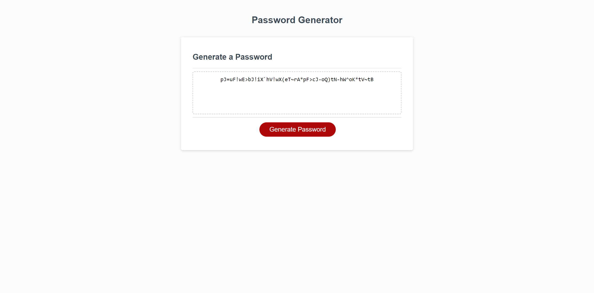

# Pass-generator

## Description
This webpage contains a basic password generator made using the power of javascript! The site itself contains a simple container with a button prompt. 

## Usage 
In order to generate your password, click on the 'Generate Password' button. You will then be asked to type the password length you are requesting. Lastly, you can specify the types of characters you'd like to include. After your password is generated you can copy from the text box and paste it wherever it's needed. 

## Here is an image of the deployed website

### Link to deployed webpage

## Support
Reach out to me if you have any questions or if you have questions at:

[My GitHub page](https://github.com/turtlesrus01)

## License
[MIT](https://github.com/turtlesrus01/horiseon-solutions/blob/main/LICENSE)
